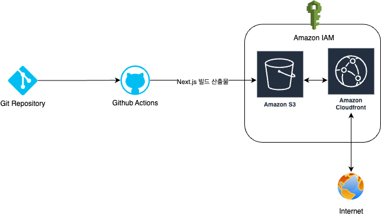
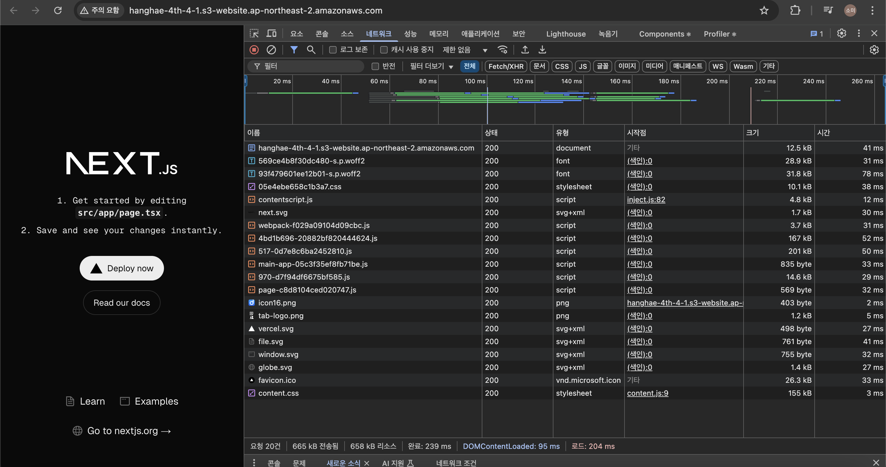
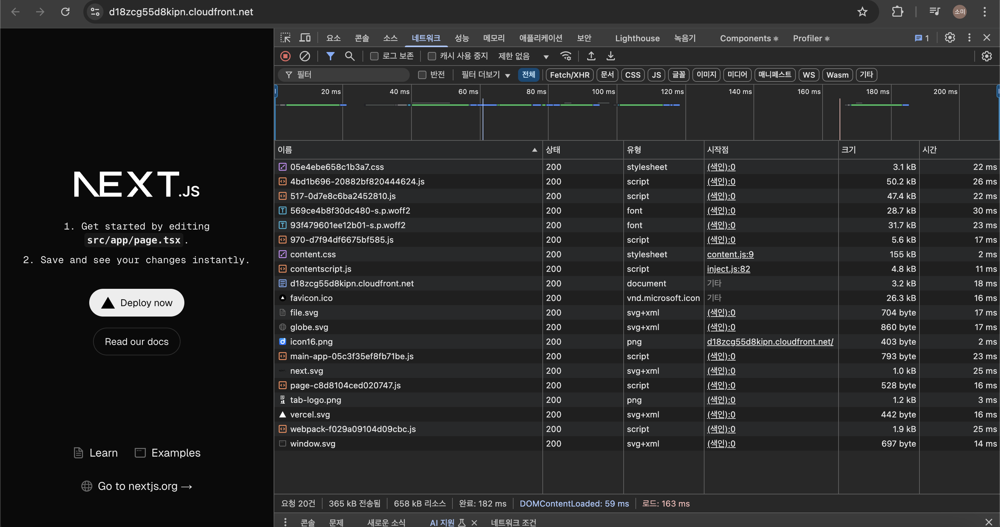
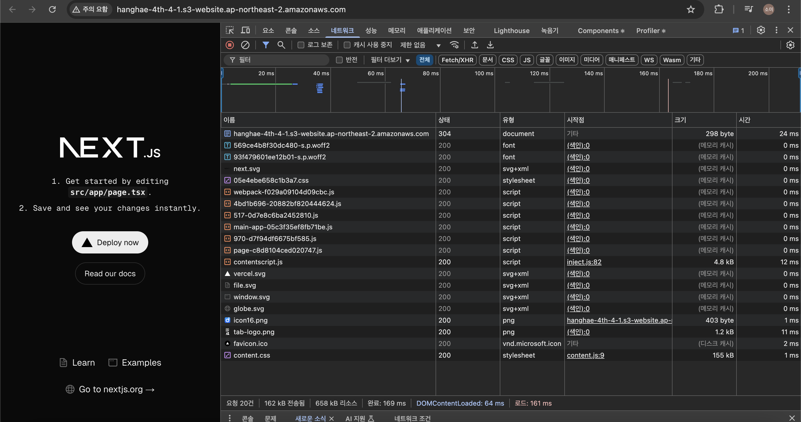
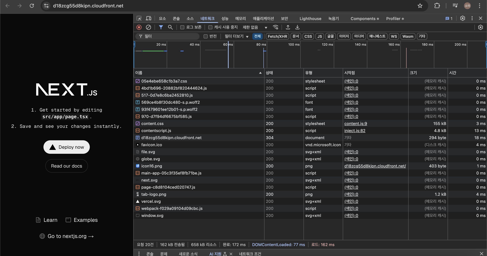

# 프론트엔드 배포 파이프라인

## 개요



GitHub Actions에 워크플로우를 작성해 main 브랜치에 push가 발생할 때 마다 다음의 작업을 수행합니다.

1. Ubuntu 환경에서 실행
1. GitHub Actions의 Checkout 액션을 사용해 저장소에서 코드를 가져오기
1. `npm ci` 명령어로 프로젝트 의존성 설치
1. `npm run build` 명령어로 Next.js 프로젝트 빌드
1. AWS 자격 증명 구성(IAM 권한으로, 접근 허용된 권한에만 접근할 수 있음)
1. 빌드된 정적 파일을 S3 버킷에 업로드
1. CloudFront 캐시 무효화

### 참고: npm ci

- `npm i` 와는 다르게 package-lock.json을 엄격히 준수하여 설치합니다
- package.json 변경사항은 무시하며, node_modules/ 을 삭제 후 재설치하여 완전한 재현 가능성을 보장합니다.
- 의존성 해석 과정이 생략되어 npm install 보다 빠르게 동작합니다.
- 즉, ci/cd 기반 빌드 환경에서 최적화된 명령어입니다.

## 주요 링크

- S3 버킷 웹사이트 엔드포인트: http://hanghae-4th-4-1.s3-website.ap-northeast-2.amazonaws.com/
- CloudFront 배포 도메인 이름: https://d18zcg55d8kipn.cloudfront.net

## 주요 개념

### GitHub Actions과 CI/CD 도구

#### GitHub Actions

- GitHub에서 제공하는 CI/CD 자동화 도구로, 저장소의 코드 변경 사항을 기반으로 빌드, 테스트, 배포 등의 작업을 자동 수행.
- .github/workflows/ 폴더에 .yml 파일로 워크플로우를 정의.
- 예시: push 또는 pull request 발생 시 테스트 실행, 빌드 후 S3에 배포 등.

#### CI/CD (Continuous Integration / Continuous Deployment)

- CI (Continuous Integration, 지속적 통합): 코드 변경 시 자동으로 빌드 & 테스트 수행 → 코드 품질 유지.
- CD (Continuous Deployment, 지속적 배포): 테스트 통과 시 자동으로 배포 → 운영 환경 반영 속도 증가.
- 대표적인 CI/CD 도구: GitHub Actions, Jenkins, GitLab CI, CircleCI 등.

#### GitHub Actions과 CI/CD 관계

- GitHub Actions은 GitHub 저장소와 통합된 CI/CD 도구로, 다른 CI/CD 시스템 없이도 자동화된 워크플로우를 구성 가능.

### S3와 스토리지

#### Amazon S3 (Simple Storage Service)

- AWS에서 제공하는 객체 스토리지 서비스로, 정적 파일(HTML, CSS, JS, 이미지, 동영상 등)을 저장하는 데 사용.
- 활용한다면 정적 웹사이트(Next.js 정적 빌드 파일) 배포, 백업 및 로그 저장하는데 사용할 수 있고, CDN과 결합하여 전 세계에 빠른 콘텐츠 제공 가능.

#### 스토리지(Storage)

- 데이터를 저장하는 공간.
- 유형: 블록 스토리지 (EBS), 파일 스토리지 (EFS), 객체 스토리지 (S3).

#### S3와 CI/CD

- npm run build로 생성된 정적 파일을 aws s3 sync 명령어를 사용해 S3에 업로드하면, 웹사이트를 호스팅 가능.
- CloudFront와 결합하면 정적 웹사이트를 글로벌 사용자에게 더 빠르게 제공할 수 있음

### CloudFront와 CDN

#### CloudFront (AWS CDN 서비스)

- AWS에서 제공하는 CDN(Content Delivery Network) 서비스.
- S3, EC2, ALB 등에서 제공하는 콘텐츠를 전 세계 엣지 로케이션을 통해 빠르게 배포.
- 리적으로 가까운 서버에서 콘텐츠 제공하므로 로딩 속도 개선 가능.
- DDoS 보호, HTTPS 지원, 캐싱 가능.
- S3와 연동하여 정적 웹사이트 성능 향상.

#### CDN (Content Delivery Network)

- 여러 개의 엣지 서버(Edge Server)에 콘텐츠를 배포하여 사용자에게 가장 가까운 서버에서 제공하는 기술.
- CloudFront 외에도 Cloudflare, Akamai, Fastly 같은 CDN 서비스 존재.

#### CloudFront와 CI/CD

- S3에 배포된 정적 파일을 CloudFront에서 캐싱하여 빠르게 제공.
- GitHub Actions로 배포 후 CloudFront 캐시 무효화하여 최신 콘텐츠 제공.

### 캐시 무효화 (Cache Invalidation)

#### 캐시(Cache)란?

- 자주 사용하는 데이터를 빠르게 제공하기 위해 저장하는 임시 저장소.
- CDN, 브라우저, 서버(메모리, Redis 등)에서 캐싱 가능.

#### Cache Invalidation (캐시 무효화)

- 기존 캐시된 데이터를 삭제하여 새로운 데이터로 갱신하는 과정.
- CloudFront에서 aws cloudfront create-invalidation --paths "/\*" 명령어를 사용하면 기존 캐시 삭제 가능.
- 이유: 정적 파일이 변경되었을 때 캐시가 갱신되지 않으면 사용자가 여전히 오래된 파일을 보게 되는 문제가 발생할 수 있음.

#### CI/CD에서 캐시 무효화 활용

- 새 코드 배포 시 캐시 무효화하여 최신 버전이 즉시 반영되도록 설정.

### Repository Secret과 환경 변수

#### Repository Secret

- GitHub Actions에서 보안이 필요한 값(AWS 키, API 키, DB 비밀번호 등)을 저장하는 공간.

  ```
  aws-access-key-id: ${{ secrets.AWS_ACCESS_KEY_ID }}
  aws-secret-access-key: ${{ secrets.AWS_SECRET_ACCESS_KEY }}
  ```

#### 환경 변수 (Environment Variable)

- OS, 애플리케이션, CI/CD 도구에서 설정하는 전역적인 변수.
- GitHub Actions에서는 env로 정의 가능.

  ```
  env:
  NODE_ENV: production
  S3_BUCKET: my-bucket
  ```

#### Repository Secret vs 환경 변수

| 구분               | Repository Secret                             | 환경 변수 (`env`)                  |
| ------------------ | --------------------------------------------- | ---------------------------------- |
| **보안성**         | GitHub에서 암호화되어 저장됨                  | 일반 환경 변수로 사용 가능         |
| **사용 목적**      | API 키, 비밀번호 등 **보안이 필요한 값** 저장 | 배포 환경 설정 값 (예: `NODE_ENV`) |
| **설정 위치**      | GitHub 저장소 **Settings > Secrets**          | `.yml` 내 `env` 또는 `.env` 파일   |
| **액세스 방법**    | `${{ secrets.MY_SECRET }}`                    | `process.env.MY_ENV`               |
| **CI/CD에서 활용** | AWS 키, DB 비밀번호, API 키 관리              | 운영/개발 환경 설정 구분           |

#### CI/CD에서 활용

- GitHub Actions에서 AWS 배포 시 Repository Secret을 사용하여 보안 정보를 안전하게 관리.
- 환경 변수로 배포 환경(production, staging 등) 설정 가능.

## CDN과 성능 최적화

### 캐시 비우기 및 강력 새고고침을 한 후의 결과

#### S3 (CDN 사용하기 전)



#### Cloud Front (CDN 사용한 후)



#### 분석

CDN을 사용하기 전에는 최초 문서를 받아오는데 일반적으로 41ms 정도가 걸렸습니다. 때론 이것보다 훨씬 느린 18초가 걸릴 때도 있었습니다. 이에 비해 CDN은 클라이언트와 가까운 거리에서 정적 파일을 받아올 수 있기 때문에 훨씬 빠른 속도(18ms)로 최초 문서를 가져올 수 있습니다. (다만, 최초 요청 시에는 원본 S3에서 데이터를 가져오기 때문에 경우에 따라 속도가 느릴 수도 있습니다.) CDN 캐싱 덕분에 반복 요청 시에는 서버 응답 속도가 더욱 빨라질 수 있습니다. 또한, CDN은 파일을 압축하여 제공하기 때문에 다운로드할 파일 크기가 비교적 작아집니다.

### 메모리 캐시, 디스크 캐시가 적용된 결과

#### S3 (CDN 사용하기 전)



#### Cloud Front (CDN 사용한 후)



#### 분석

여전히 통신을 사용하여 가져와야 하는 리소스에 대해서 CDN을 사용했을 때가 S3만 사용했을 때보다 빠르게 작동한다는 것을 알 수 있습니다.
